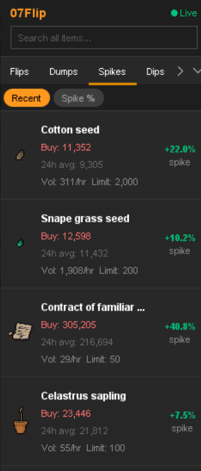
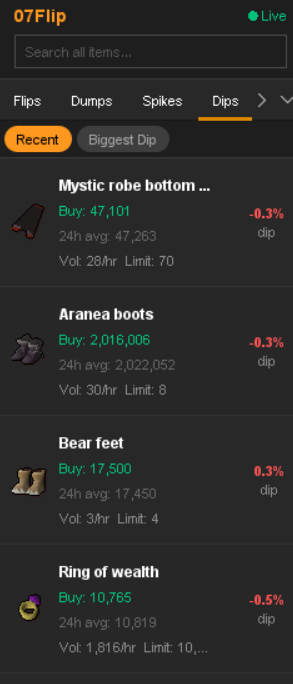

# 07Flip — GE Flip Finder

A RuneLite plugin that surfaces live Grand Exchange flipping data from [07flip.com](https://07flip.com) directly inside your client. Top flips, dump warnings, price spikes and dips, premium merch alerts, Moon and Barrows armour repair flips, potion decanting profit, plus a local trade tracker — all in one sidebar panel.

## ✅ No account required for the basics

Most of the plugin works out of the box. An API key from [07flip.com](https://07flip.com) unlocks the premium tabs and optional trade syncing.

| Feature | Free | API key |
|---|:-:|:-:|
| Flips, Dumps, Spikes, Dips, Decant tabs | ✅ | ✅ |
| All Grand Exchange overlays | ✅ | ✅ |
| Local My Trades history | ✅ | ✅ |
| Merch Alerts (premium) | — | ✅ paid |
| Moon armour repair flips | — | ✅ |
| Barrows armour repair flips | — | ✅ |
| My Trades website sync | — | ✅ |

To get an API key: sign up at [07flip.com](https://07flip.com), log in with Discord, click your Discord icon (top-right) and select **View API Key**. Paste it into the plugin's General config section.

**No player data is ever sent to 07flip.com.** The optional My Trades website sync transmits only item ID, quantity and price — your account name is never included.

## ✨ Sidebar panel

Open the panel from the **07Flip** icon in the RuneLite sidebar. Every tab can be hidden individually in config.

### Flips — top GE flip opportunities

The most profitable Grand Exchange flips right now, refreshed in real time. Each row shows the recommended buy and sell prices, profit after the 2% GE tax, ROI, the GE buy limit, and total potential profit across one 4-hour buy-limit cycle. Click any row to open the item's full analysis on 07flip.com, or right-click for quick **Buy on GE** / **Sell on GE** menu options.

### Dumps — items being mass-sold

Items that have just been heavily dumped by big traders, often available temporarily below their normal trade range. Useful for spotting short-term value buys before the market re-balances.

### Spikes — fast-moving price increases

Items whose price has jumped sharply in a short time window. Surfaces momentum opportunities early, before they appear on common watchlists.

### Dips — sharp price drops

The mirror of Spikes — items whose price has just fallen sharply. Useful for buy-the-dip plays on long-term flips and for catching overreactions to short-term news.

### Alerts — conviction-tier merch alerts *(premium)*

Active merch detector alerts: items where 07flip.com's models have flagged a high-conviction long-hold opportunity. Each row shows the entry price, target sell price, expected upside %, suggested hold time, 90-day high/low and the current drawdown from the 90-day high.

Requires an API key on a premium 07flip.com plan.

### Moon — Moon armour repair flips

Pieces and full sets from the Moon raid that are currently profitable to buy broken, repair at the POH armour stand, and resell whole. Repair cost is calculated from your configured Smithing level, so the displayed profit is your **net** profit after repair materials.

Requires an API key.

### Barrows — Barrows armour repair flips

Same idea as Moon but for the six Barrows brothers' sets and individual pieces. Repair cost is again computed from your Smithing level for an accurate net-profit figure.

Requires an API key.

### Decant — potion decanting profit

The most profitable potion (4) → (3) → (2) → (1) decanting opportunities right now, computed across the whole live GE potion market. Click a row for the full breakdown on 07flip.com.

### My Trades — local trade tracker

Automatically records every Grand Exchange buy and sell that completes while the plugin is running. Stored locally — your history persists across sessions and is yours alone.

If you have an API key and opt in to **Share trade data with 07flip.com** in config, the plugin will also send each completed trade to your account on the website so you can browse your full history under the Tracker feature there. Only `item ID`, `quantity` and `price` are sent — your account name is never included.

## 🎯 Grand Exchange integration

The plugin layers helpful overlays directly into the GE interface. None of these require an API key.

### Movable price overlay on the GE setup screen
While placing an offer, a small movable overlay shows 07Flip's recommended buy and sell prices for the current item. **Right-click either price** to instantly fill it into the custom price input — no typing.

### Slot price colouring
On the GE main screen, your active slot prices are tinted **green** when they're at or better than 07Flip's recommended price, **red** when they're worse. At-a-glance feedback on whether your offers are likely to fill at a good price.

### "Enter price" button highlight
After right-clicking a flip in the panel and choosing **Buy on GE** or **Sell on GE**, the in-game *Enter price* button glows yellow as a reminder to use a custom price rather than instant-buy or instant-sell. Helpful when you're new to the workflow.

### Inventory check on Sell
The right-click **Sell on GE** option only appears when the item is actually in your inventory, keeping the menu clean and preventing accidental clicks.

## ⚙️ Configuration

Open the RuneLite config (wrench icon) → **07Flip**. Settings are grouped into four sections.

**General**
- **API key** — your 07flip.com key (optional; unlocks premium features)
- **Refresh interval** — how often to fetch new data (60–600 s, default 90)
- **Smithing level** — used to calculate POH repair cost for Moon and Barrows

**Panel tabs** — show or hide each of the nine tabs individually.

**Grand Exchange integration**
- **Slot price colouring** — green/red tinting on active GE slots
- **Show price overlay on GE setup** — movable overlay with right-click auto-fill
- **Highlight 'Enter price' button** — yellow ring after right-clicking a flip
- **Hide 'Sell on GE' when not carrying item** — keeps the right-click menu clean

**Trade tracker**
- **Share trade data with 07flip.com** — opt-in website sync (item ID + qty + price only, no account name; requires API key)

## 🚀 Getting started

1. Install **07Flip** from the RuneLite Plugin Hub.
2. Click the **07Flip** icon in the RuneLite sidebar — the Flips tab opens by default.
3. *(Optional)* Sign up at [07flip.com](https://07flip.com) for an API key to unlock Alerts, Moon, Barrows and trade syncing.
4. Right-click any flip → **Buy on GE** to be guided into the offer setup screen with the recommended price ready.

## 💡 Tips

- **Use right-click on the GE overlay** to auto-fill the recommended buy or sell price — it's the fastest way to place a precisely-priced offer.
- **Hide tabs you don't use** in the Panel tabs config section to keep the panel compact.
- **Set your Smithing level** in General config so Moon and Barrows profits are accurate to your repair cost.
- **The Decant tab updates live** — small price changes can flip a potion conversion from profitable to not, so refresh before placing decant orders.
- **My Trades persists locally** — even if you close RuneLite, your tracked history is still there next session.

## 🛠️ Troubleshooting

**Premium tabs (Alerts / Moon / Barrows) show empty or "API key required"**
- Check your API key is pasted correctly into General → API key.
- Make sure your 07flip.com plan covers the tab you're trying to use (Alerts is premium-only).

**Slot price colouring isn't showing**
- Confirm **Slot price colouring** is enabled in the Grand Exchange integration config section.
- The colouring only appears once 07Flip has loaded recommended prices for that item; give it a few seconds after opening the GE.

**My Trades isn't recording new trades**
- Trades are only recorded while the plugin is running and you're logged into OSRS.
- Trades that completed before the plugin was installed cannot be backfilled.

## 🔗 Links

- Website: [07flip.com](https://07flip.com)
- Discord: [Join our community](https://discord.gg/xQaYM9TaMr)

## 📝 License

BSD 2-Clause — see [LICENSE](LICENSE).
