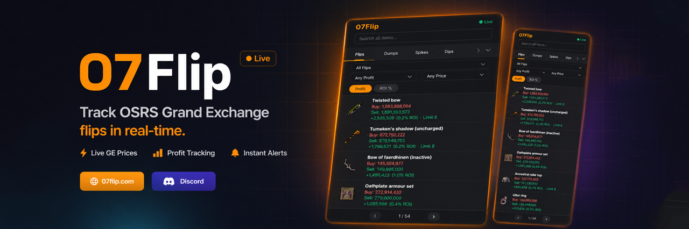
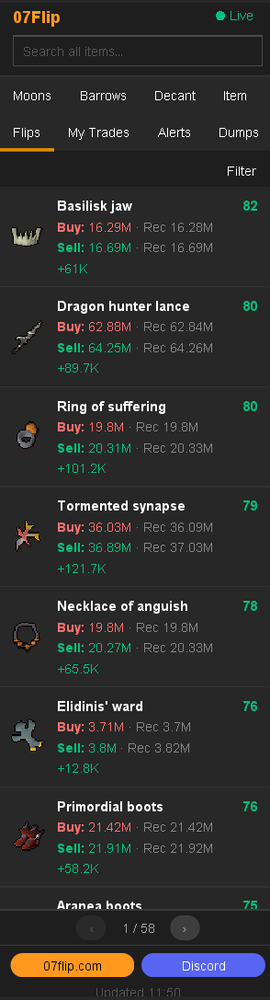
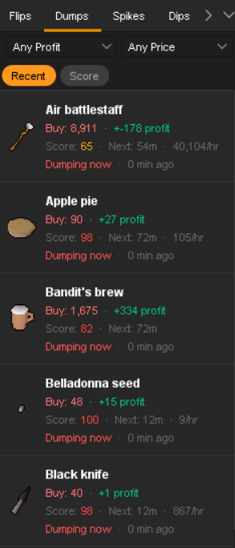
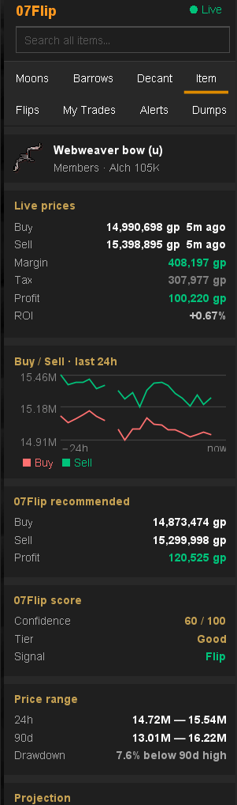
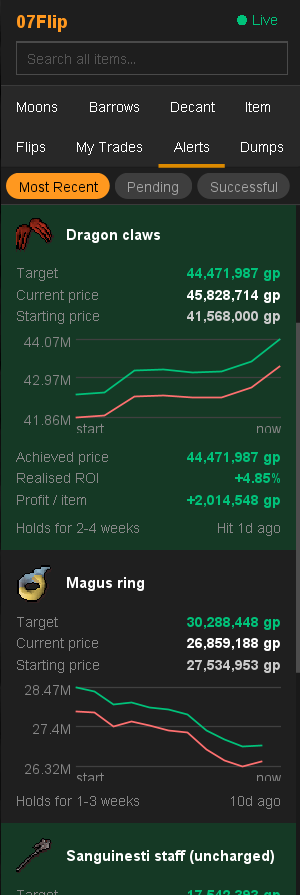
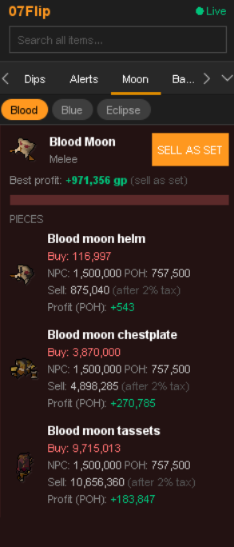
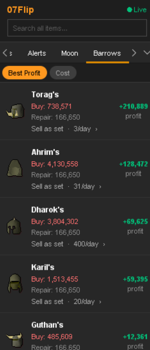
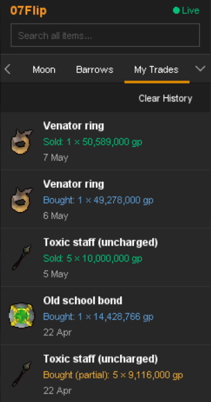
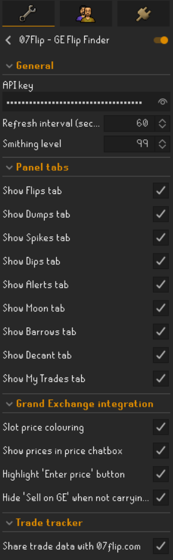

# 07Flip — GE Flip Finder

A RuneLite plugin that surfaces live Grand Exchange flipping data from [07flip.com](https://07flip.com) directly inside your client. Top flips, dump warnings, per-item insights, premium merch alerts, Moon and Barrows armour repair flips, potion decanting profit, plus a local trade tracker with automatic price entry on the GE setup screen — all in one sidebar panel.

## ✅ No account required for the basics

Most of the plugin works out of the box. An API key from [07flip.com](https://07flip.com) unlocks the premium tabs and optional trade syncing.

| Feature | Free | API key |
|---|:-:|:-:|
| Flips, Dumps, Item, Decant tabs | ✅ | ✅ |
| All Grand Exchange overlays and auto price-fill | ✅ | ✅ |
| Local My Trades history | ✅ | ✅ |
| Merch Alerts (premium) | — | ✅ |
| Moon armour repair flips | — | ✅ |
| Barrows armour repair flips | — | ✅ |
| My Trades website sync | — | ✅ |

To get an API key: sign up at [07flip.com](https://07flip.com), log in with Discord, click your Discord icon (top-right) and select **View API Key**. Paste it into the plugin's General config section.

**No player data is ever sent to 07flip.com.** The optional My Trades website sync transmits only item ID, quantity and price — your account name is never included.

## ✨ Sidebar panel

Open the panel from the **07Flip** icon in the RuneLite sidebar. Every tab can be hidden individually in config.

### Flips — top GE flip opportunities

The most profitable Grand Exchange flips right now, refreshed in real time. Each row shows the recommended buy and sell prices, profit after the 2% GE tax, ROI, the GE buy limit, and a margin · limit summary. Left-click any row to open it in the **Item** tab for the full analysis, or right-click for quick **Buy on GE** / **Sell on GE** menu options that guide you through the offer setup.

### Dumps — items being mass-sold

Items that have just been heavily dumped by big traders, often available temporarily below their normal trade range. Useful for spotting short-term value buys before the market re-balances.

### Item — full per-item analysis

Left-click any item row anywhere in the plugin to load it in the **Item** tab. The free tier shows live buy/sell prices, a dual-line 24-hour buy/sell sparkline with axes, hourly and daily GE volume, and any active merch alerts on the item. With a premium API key you also get 07flip.com's recommended buy/sell prices, the item's score, 24-hour price range, and the model's projection.

Without a selection the tab shows the top three recommended items so you always have something actionable on screen.

### Alerts — conviction-tier merch alerts *(premium)*

Active merch detector alerts: items where 07flip.com's models have flagged a high-conviction long-hold opportunity. Each card shows the target sell price, the current price, the starting price when the alert fired, expected hold time, and a per-card sparkline. A **Successful** tab tracks alerts that have hit their targets with the achieved price, realised ROI and per-item profit.

Free users can view the Successful tab. Active alerts require an API key on a premium 07flip.com plan.

### Moon — Moon armour repair flips

Pieces and full sets from the Moon raid that are currently profitable to buy broken, repair at the POH armour stand, and resell whole. Repair cost is calculated from your configured Smithing level, so the displayed profit is your **net** profit after repair materials.

Requires an API key.

### Barrows — Barrows armour repair flips

Same idea as Moon but for the six Barrows brothers' sets and individual pieces. Repair cost is again computed from your Smithing level for an accurate net-profit figure.

Requires an API key.

### Decant — potion decanting profit

The most profitable potion (4) → (3) → (2) → (1) decanting opportunities right now, computed across the whole live GE potion market. Click a row to view the full breakdown in the Item tab or on 07flip.com.

### My Trades — local trade tracker

Automatically records every Grand Exchange buy and sell that completes while the plugin is running. The tab shows your live GE state with progress bars on every active offer, completed flip history with FIFO-matched profit per row, a stats section (total / today / best / worst profit, win rate, average ROI, GE tax paid, membership cost), and an activity section (this week / this month). Sort by Recent / Margin / Active and paginate five rows at a time.

History is stored locally and persists across sessions. If you have an API key and opt in to **Share trade data with 07flip.com** in config, the plugin will also send each completed trade to your account on the website so you can browse your full history under the Tracker feature there. Only `item ID`, `quantity` and `price` are sent — your account name is never included.

## 🎯 Grand Exchange integration

The plugin layers helpful overlays directly into the GE interface. None of these require an API key.

### Movable price overlay on the GE setup screen
While placing an offer, a small movable overlay shows 07Flip's recommended buy and sell prices for the current item. **Right-click either price** to instantly fill it into the custom price input — no typing.

### Guided Buy on GE workflow
Right-click a flip in the panel → **Buy on GE**. The plugin highlights the next correct empty slot in cyan, auto-types the item name into the GE search the moment you click it, glows the *Enter price* button yellow once you reach the offer setup screen, and fills the recommended buy price as soon as you open the custom-price input. Confirm and you're done.

### Guided Sell on GE workflow
Click any item in your inventory to start a sell offer. The plugin detects the sell setup screen, glows the *Enter price* button yellow, and fills the recommended sell price (or your frozen-on-buy price, whichever is higher) when you open the custom-price input.

### Frozen sell prices
When you queue a buy via the panel, 07Flip pins the recommended sell price at that moment. If the market drifts down before your buy completes, the frozen price still appears on the sell setup so you don't accidentally undercut yourself out of the projected margin. The freeze clears automatically once you fully sell the position.

### Inventory tooltip with cost basis and ROI
Hover any item in your inventory to see 07Flip's recommended sell price, your FIFO-matched cost basis from local trade history, and the live ROI if you sold right now. Coloured green when you're in profit, red when you're underwater.

### GP drop animation on completed offers
Each time a flip completes, a fading **+X gp** / **−X gp** number drops near the GE interface so you get instant visual feedback on the trade's outcome — no need to switch to a separate panel to confirm the profit.

### Inventory check on Sell
The right-click **Sell on GE** option only appears when the item is actually in your inventory, keeping the menu clean and preventing accidental clicks.

## ⚙️ Configuration

Open the RuneLite config (wrench icon) → **07Flip**. Settings are grouped into five sections.

**General**
- **API key** — your 07flip.com key (optional; unlocks premium features)
- **Refresh interval** — how often to fetch new data (60–600 s, default 90)
- **Smithing level** — used to calculate POH repair cost for Moon and Barrows
- **Personalised flips by cash stack** — filter Flips to items you can afford, with cash rounded down to the nearest 100k gp before it leaves your machine

**Panel tabs** — show or hide each of the eight tabs individually.

**Tab order** — open a small dialog to drag tabs into your preferred left-to-right order.

**Grand Exchange integration**
- **Show price overlay on GE setup** — movable overlay with right-click auto-fill
- **Highlight 'Enter price' button** — yellow ring when an auto-fill is queued
- **Hide 'Sell on GE' when not carrying item** — keeps the right-click menu clean
- **Show GP drop animation on completed sells** — fading profit number on the GE interface
- **Show inventory tooltip with cost basis** — hover an item to see your basis and recommended sell

**Trade tracker**
- **Share trade data with 07flip.com** — opt-in website sync (item ID + qty + price only, no account name; requires API key)

## 🚀 Getting started

1. Install **07Flip** from the RuneLite Plugin Hub.
2. Click the **07Flip** icon in the RuneLite sidebar — the Flips tab opens by default.
3. *(Optional)* Sign up at [07flip.com](https://07flip.com) for an API key to unlock Alerts, Moon, Barrows and trade syncing.
4. Right-click any flip → **Buy on GE** to be guided into the offer setup screen with the recommended price ready.

## 💡 Tips

- **Right-click the GE overlay** to auto-fill the recommended price — the fastest way to place a precisely-priced offer.
- **Click any item row** anywhere in the plugin to open it in the Item tab for the full chart, volume and recommendation breakdown.
- **Hide tabs you don't use** in the Panel tabs config section to keep the panel compact.
- **Set your Smithing level** in General config so Moon and Barrows profits are accurate to your repair cost.
- **Watch the GP-drop animation** on the GE for live feedback on each completed offer.
- **My Trades persists locally** — even if you close RuneLite, your tracked history is still there next session.

## 🛠️ Troubleshooting

**Premium tabs (Alerts / Moon / Barrows) show empty or "API key required"**
- Check your API key is pasted correctly into General → API key.
- Make sure your 07flip.com plan covers the tab you're trying to use (Alerts is premium-only).

**The 'Enter price' button isn't highlighting on a sell**
- The highlight only fires when 07Flip has a recommended sell price for the item — give it a few seconds after the sell setup screen appears for the first fetch to complete.

**My Trades isn't recording new trades**
- Trades are only recorded while the plugin is running and you're logged into OSRS.
- Trades that completed before the plugin was installed cannot be backfilled.

## 🔗 Links

- Website: [07flip.com](https://07flip.com)
- Discord: [Join our community](https://discord.gg/xQaYM9TaMr)

## 📝 License

BSD 2-Clause — see [LICENSE](LICENSE).
